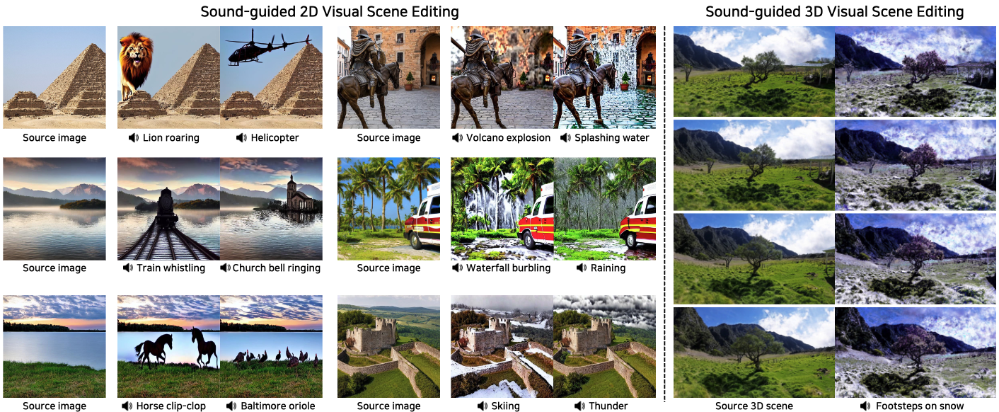

# SoundBrush (AAAI 2025)

### [Project Page](https://soundbrush.github.io/) | [Paper](https://arxiv.org/abs/2501.00645) | [Dataset](https://soundbrush.github.io/)
This repository contains a pytorch implementation for the AAAI 2025 paper, [SoundBrush: Sound as a Brush for Visual Scene Editing](https://soundbrush.github.io/). SoundBrush can manipulate scenes to reflect the mood of the input audio or to insert sounding objects while preserving the original content.<br><br>

 

## Getting started
This code was developed on Ubuntu 18.04 with Python 3.8, CUDA 11.7 and PyTorch 2.0.1. Later versions should work, but have not been tested.

### Installation
Create and activate a virtual environment to work in:
```
conda create --n soundbrush python=3.8
conda activate soundbrush
```

Install the requirements with pip and [PyTorch](https://pytorch.org/). For CUDA 11.7, this would look like:
```
pip insall -r requirements.txt
pip install torch==2.0.1 torchvision==0.15.2 torchaudio==2.0.2
```

### Download models
To run SoundBrush, you need to download the pretrained model.
Download [pretrained model](https://drive.google.com/file/d/1W3W34L-ERt_n4mm7Osx9-6IXkbanOWdF/view?usp=sharing).

After downloading the models, place them in `./checkpoints`.
```
./checkpoints/model.ckpt
```

## Demo
Run below command to inference the model.
We provide sample images and audios in **./source_images** and **./source_wavs**, respectively. 
The edited images will be saved in **./outputs**

```
python edit_inference.py --audio_dir <audio directory> --img_dir <ikmg dir> --save_dir <output dir>

#or simply run

sh inference.sh
```

## Agreement
- The SoundBrush dataset is provided for non-commercial research purposes only. 
- All wavfile and images of the SoundBrush dataset are sourced from the Internet and do not belong to our institutions. Our institutions do not take responsibility for the content or the meaning of these videos.
- You agree not to reproduce, duplicate, copy, sell, trade, resell, or exploit any portion of the videos and any portion of derived data for commercial purposes.
- You agree not to further copy, publish, or distribute any portion of the SoundBrush dataset. Except, it is allowed to make copies of the dataset for internal use at a single site within the same organization.


## **Notes**
```
@inproceedings{soundbrush,
  title     = {SoundBrush: Sound as a Brush for Visual Scene Editing},
  author    = {Sung-Bin, Kim and Jun-Seong, Kim and Ko, Junseok and Kim, Yewon and Oh, Tae-Hyun},
  booktitle = {Proceedings of the AAAI Conference on Artificial Intelligence},
  year      = {2025},
}
```


## **Acknowledgement**
We heavily borrow the code from [InstructPix2Pix](https://github.com/timothybrooks/instruct-pix2pix) and [ImageBind](https://github.com/facebookresearch/ImageBind) and the dataset from [VGGSound](https://www.robots.ox.ac.uk/~vgg/data/vggsound/), and the agreement statement from [CelebV-HQ](https://github.com/CelebV-HQ/CelebV-HQ?tab=readme-ov-file). We sincerely appreciate those authors.


[//]: # (# InstructPix2Pix: Learning to Follow Image Editing Instructions)

[//]: # (### [Project Page]&#40;https://www.timothybrooks.com/instruct-pix2pix/&#41; | [Paper]&#40;https://arxiv.org/abs/2211.09800&#41; | [Data]&#40;http://instruct-pix2pix.eecs.berkeley.edu/&#41;)

[//]: # (PyTorch implementation of InstructPix2Pix, an instruction-based image editing model, based on the original [CompVis/stable_diffusion]&#40;https://github.com/CompVis/stable-diffusion&#41; repo. <br>)

[//]: # ()
[//]: # ([InstructPix2Pix: Learning to Follow Image Editing Instructions]&#40;https://www.timothybrooks.com/instruct-pix2pix/&#41;  )

[//]: # ( [Tim Brooks]&#40;https://www.timothybrooks.com/&#41;\*,)

[//]: # ( [Aleksander Holynski]&#40;https://holynski.org/&#41;\*,)

[//]: # ( [Alexei A. Efros]&#40;https://people.eecs.berkeley.edu/~efros/&#41; <br>)

[//]: # ( UC Berkeley <br>)

[//]: # (  \*denotes equal contribution  )

[//]: # (  )
[//]: # (  )

[//]: # ()
[//]: # (## TL;DR: quickstart )

[//]: # ()
[//]: # (Follow the instructions below to download and run InstructPix2Pix on your own images. These instructions have been tested on a GPU with >18GB VRAM. If you don't have a GPU, you may need to change the default configuration, or check out [other ways of using the model]&#40;https://github.com/timothybrooks/instruct-pix2pix#other-ways-of-using-instructpix2pix&#41;. )

[//]: # ()
[//]: # (### Set up a conda environment, and download a pretrained model:)

[//]: # (```)

[//]: # (conda env create -f environment.yaml)

[//]: # (conda activate ip2p)

[//]: # (bash scripts/download_checkpoints.sh)

[//]: # (```)

[//]: # ()
[//]: # (### Edit a single image:)

[//]: # (```)

[//]: # (python edit_cli.py --input imgs/example.jpg --output imgs/output.jpg --edit "turn him into a cyborg")

[//]: # ()
[//]: # (# Optionally, you can specify parameters to tune your result:)

[//]: # (# python edit_cli.py --steps 100 --resolution 512 --seed 1371 --cfg-text 7.5 --cfg-image 1.2 --input imgs/example.jpg --output imgs/output.jpg --edit "turn him into a cyborg")

[//]: # (```)

[//]: # ()
[//]: # (### Or launch your own interactive editing Gradio app:)

[//]: # (```)

[//]: # (python edit_app.py )

[//]: # (```)

[//]: # (![Edit app]&#40;https://github.com/timothybrooks/instruct-pix2pix/blob/main/imgs/edit_app.jpg?raw=true&#41;)

[//]: # ()
[//]: # (_&#40;For advice on how to get the best results by tuning parameters, see the [Tips]&#40;https://github.com/timothybrooks/instruct-pix2pix#tips&#41; section&#41;._)

[//]: # ()
[//]: # (## Setup)

[//]: # ()
[//]: # (Install all dependencies with:)

[//]: # (```)

[//]: # (conda env create -f environment.yaml)

[//]: # (```)

[//]: # ()
[//]: # (Download the pretrained models by running:)

[//]: # (```)

[//]: # (bash scripts/download_checkpoints.sh)

[//]: # (```)

[//]: # ()
[//]: # (### Download BEATs and LDM checkpoint)

[//]: # (Make ./checkpoint directory and put the downloaded checkpoints &#40;[BEATS]&#40;https://www.dropbox.com/scl/fi/0yrhyqoyng8wlwtelm5j5/BEATs_iter3_plus_AS2M_finetuned_on_AS2M_cpt2.pt?rlkey=x9mfw33j06yc5nr0os8cy7w5d&st=si15p9mr&dl=0&#41; | [LDM]&#40;https://github.com/timothybrooks/instruct-pix2pix#tips&#41;&#41;)

[//]: # ()
[//]: # (The example wav files are in ./wavs and the source images are in ./source_images.)

[//]: # ()
[//]: # (Run:)

[//]: # (```)

[//]: # (bash inference_js.sh)

[//]: # (```)

[//]: # ()
[//]: # ()
[//]: # ()
[//]: # ([//]: # &#40;## Generated Dataset&#41;)
[//]: # ()
[//]: # ([//]: # &#40;&#41;)
[//]: # ([//]: # &#40;Our image editing model is trained on a generated dataset consisting of 454,445 examples. Each example contains &#40;1&#41; an input image, &#40;2&#41; an editing instruction, and &#40;3&#41; an output edited image. We provide two versions of the dataset, one in which each pair of edited images is generated 100 times, and the best examples are chosen based on CLIP metrics &#40;Section 3.1.2 in the paper&#41; &#40;`clip-filtered-dataset`&#41;, and one in which examples are randomly chosen &#40;`random-sample-dataset`&#41;.&#41;)
[//]: # ()
[//]: # ([//]: # &#40;&#41;)
[//]: # ([//]: # &#40;For the released version of this dataset, we've additionally filtered prompts and images for NSFW content. After NSFW filtering, the GPT-3 generated dataset contains 451,990 examples. The final image-pair datasets contain:&#41;)
[//]: # ()
[//]: # ([//]: # &#40;&#41;)
[//]: # ([//]: # &#40;|  | # of image editing examples | Dataset size |&#41;)
[//]: # ()
[//]: # ([//]: # &#40;|--|-----------------------|----------------------- |&#41;)
[//]: # ()
[//]: # ([//]: # &#40;| `random-sample-dataset` |451990|727GB|&#41;)
[//]: # ()
[//]: # ([//]: # &#40;|  `clip-filtered-dataset` |313010|436GB|&#41;)
[//]: # ()
[//]: # ([//]: # &#40;&#41;)
[//]: # ([//]: # &#40;To download one of these datasets, along with the entire NSFW-filtered text data, run the following command with the appropriate dataset name:&#41;)
[//]: # ()
[//]: # ([//]: # &#40;&#41;)
[//]: # ([//]: # &#40;```&#41;)
[//]: # ()
[//]: # ([//]: # &#40;bash scripts/download_data.sh clip-filtered-dataset&#41;)
[//]: # ()
[//]: # ([//]: # &#40;```&#41;)
[//]: # ()
[//]: # ([//]: # &#40;&#41;)
[//]: # ([//]: # &#40;&#41;)
[//]: # ([//]: # &#40;## Training InstructPix2Pix&#41;)
[//]: # ()
[//]: # ([//]: # &#40;&#41;)
[//]: # ([//]: # &#40;InstructPix2Pix is trained by fine-tuning from an initial StableDiffusion checkpoint. The first step is to download a Stable Diffusion checkpoint. For our trained models, we used the v1.5 checkpoint as the starting point. To download the same ones we used, you can run the following script:&#41;)
[//]: # ()
[//]: # ([//]: # &#40;```&#41;)
[//]: # ()
[//]: # ([//]: # &#40;bash scripts/download_pretrained_sd.sh&#41;)
[//]: # ()
[//]: # ([//]: # &#40;```&#41;)
[//]: # ()
[//]: # ([//]: # &#40;If you'd like to use a different checkpoint, point to it in the config file `configs/train.yaml`, on line 8, after `ckpt_path:`. &#41;)
[//]: # ()
[//]: # ([//]: # &#40;&#41;)
[//]: # ([//]: # &#40;Next, we need to change the config to point to our downloaded &#40;or generated&#41; dataset. If you're using the `clip-filtered-dataset` from above, you can skip this. Otherwise, you may need to edit lines 85 and 94 of the config &#40;`data.params.train.params.path`, `data.params.validation.params.path`&#41;. &#41;)
[//]: # ()
[//]: # ([//]: # &#40;&#41;)
[//]: # ([//]: # &#40;Finally, start a training job with the following command:&#41;)
[//]: # ()
[//]: # ([//]: # &#40;&#41;)
[//]: # ([//]: # &#40;```&#41;)
[//]: # ()
[//]: # ([//]: # &#40;python main.py --name default --base configs/train.yaml --train --gpus 0,1,2,3,4,5,6,7&#41;)
[//]: # ()
[//]: # ([//]: # &#40;```&#41;)
[//]: # ()
[//]: # ([//]: # &#40;&#41;)
[//]: # ([//]: # &#40;&#41;)
[//]: # ([//]: # &#40;## Creating your own dataset&#41;)
[//]: # ()
[//]: # ([//]: # &#40;&#41;)
[//]: # ([//]: # &#40;Our generated dataset of paired images and editing instructions is made in two phases: First, we use GPT-3 to generate text triplets: &#40;a&#41; a caption describing an image, &#40;b&#41; an edit instruction, &#40;c&#41; a caption describing the image after the edit. Then, we turn pairs of captions &#40;before/after the edit&#41; into pairs of images using Stable Diffusion and Prompt-to-Prompt.&#41;)
[//]: # ()
[//]: # ([//]: # &#40;&#41;)
[//]: # ([//]: # &#40;### &#40;1&#41; Generate a dataset of captions and instructions&#41;)
[//]: # ()
[//]: # ([//]: # &#40;&#41;)
[//]: # ([//]: # &#40;We provide our generated dataset of captions and edit instructions [here]&#40;https://instruct-pix2pix.eecs.berkeley.edu/gpt-generated-prompts.jsonl&#41;. If you plan to use our captions+instructions, skip to step &#40;2&#41;. Otherwise, if you would like to create your own text dataset, please follow steps &#40;1.1-1.3&#41; below. Note that generating very large datasets using GPT-3 can be expensive.&#41;)
[//]: # ()
[//]: # ([//]: # &#40;&#41;)
[//]: # ([//]: # &#40;#### &#40;1.1&#41; Manually write a dataset of instructions and captions&#41;)
[//]: # ()
[//]: # ([//]: # &#40;&#41;)
[//]: # ([//]: # &#40;The first step of the process is fine-tuning GPT-3. To do this, we made a dataset of 700 examples broadly covering of edits that we might want our model to be able to perform. Our examples are available [here]&#40;https://instruct-pix2pix.eecs.berkeley.edu/human-written-prompts.jsonl&#41;. These should be diverse and cover a wide range of possible captions and types of edits. Ideally, they should avoid duplication or significant overlap of captions and instructions. It is also important to be mindful of limitations of Stable Diffusion and Prompt-to-Prompt in writing these examples, such as inability to perform large spatial transformations &#40;e.g., moving the camera, zooming in, swapping object locations&#41;. &#41;)
[//]: # ()
[//]: # ([//]: # &#40;&#41;)
[//]: # ([//]: # &#40;Input prompts should closely match the distribution of input prompts used to generate the larger dataset. We sampled the 700 input prompts from the _LAION Improved Aesthetics 6.5+_ dataset and also use this dataset for generating examples. We found this dataset is quite noisy &#40;many of the captions are overly long and contain irrelevant text&#41;. For this reason, we also considered MSCOCO and LAION-COCO datasets, but ultimately chose _LAION Improved Aesthetics 6.5+_ due to its diversity of content, proper nouns, and artistic mediums. If you choose to use another dataset or combination of datasets as input to GPT-3 when generating examples, we recommend you sample the input prompts from the same distribution when manually writing training examples.&#41;)
[//]: # ()
[//]: # ([//]: # &#40;&#41;)
[//]: # ([//]: # &#40;#### &#40;1.2&#41; Finetune GPT-3&#41;)
[//]: # ()
[//]: # ([//]: # &#40;&#41;)
[//]: # ([//]: # &#40;The next step is to finetune a large language model on the manually written instructions/outputs to generate edit instructions and edited caption from a new input caption. For this, we finetune GPT-3's Davinci model via the OpenAI API, although other language models could be used.&#41;)
[//]: # ()
[//]: # ([//]: # &#40;&#41;)
[//]: # ([//]: # &#40;To prepare training data for GPT-3, one must first create an OpenAI developer account to access the needed APIs, and [set up the API keys on your local device]&#40;https://beta.openai.com/docs/api-reference/introduction&#41;. Also, run the `prompts/prepare_for_gpt.py` script, which forms the prompts into the correct format by concatenating instructions and captions and adding delimiters and stop sequences.&#41;)
[//]: # ()
[//]: # ([//]: # &#40;&#41;)
[//]: # ([//]: # &#40;```bash&#41;)
[//]: # ()
[//]: # ([//]: # &#40;python dataset_creation/prepare_for_gpt.py --input-path data/human-written-prompts.jsonl --output-path data/human-written-prompts-for-gpt.jsonl&#41;)
[//]: # ()
[//]: # ([//]: # &#40;```&#41;)
[//]: # ()
[//]: # ([//]: # &#40;&#41;)
[//]: # ([//]: # &#40;Next, finetune GPT-3 via the OpenAI CLI. We provide an example below, although please refer to OpenAI's official documentation for this, as best practices may change. We trained the Davinci model for a single epoch. You can experiment with smaller less expensive GPT-3 variants or with open source language models, although this may negatively affect performance.&#41;)
[//]: # ()
[//]: # ([//]: # &#40;&#41;)
[//]: # ([//]: # &#40;```bash&#41;)
[//]: # ()
[//]: # ([//]: # &#40;openai api fine_tunes.create -t data/human-written-prompts-for-gpt.jsonl -m davinci --n_epochs 1 --suffix "instruct-pix2pix"&#41;)
[//]: # ()
[//]: # ([//]: # &#40;```&#41;)
[//]: # ()
[//]: # ([//]: # &#40;&#41;)
[//]: # ([//]: # &#40;You can test out the finetuned GPT-3 model by launching the provided Gradio app:&#41;)
[//]: # ()
[//]: # ([//]: # &#40;&#41;)
[//]: # ([//]: # &#40;```bash&#41;)
[//]: # ()
[//]: # ([//]: # &#40;python prompt_app.py --openai-api-key OPENAI_KEY --openai-model OPENAI_MODEL_NAME&#41;)
[//]: # ()
[//]: # ([//]: # &#40;```&#41;)
[//]: # ()
[//]: # ([//]: # &#40;&#41;)
[//]: # ([//]: # &#40;![Prompt app]&#40;https://github.com/timothybrooks/instruct-pix2pix/blob/main/imgs/prompt_app.jpg?raw=true&#41;&#41;)
[//]: # ()
[//]: # ([//]: # &#40;&#41;)
[//]: # ([//]: # &#40;#### &#40;1.3&#41; Generate a large dataset of captions and instructions&#41;)
[//]: # ()
[//]: # ([//]: # &#40;&#41;)
[//]: # ([//]: # &#40;We now use the finetuned GPT-3 model to generate a large dataset. Our dataset cost thousands of dollars to create. See `prompts/gen_instructions_and_captions.py` for the script which generates these examples. We recommend first generating a small number of examples &#40;by setting a low value of `--num-samples`&#41; and gradually increasing the scale to ensure the results are working as desired before increasing scale.&#41;)
[//]: # ()
[//]: # ([//]: # &#40;&#41;)
[//]: # ([//]: # &#40;```bash&#41;)
[//]: # ()
[//]: # ([//]: # &#40;python dataset_creation/generate_txt_dataset.py --openai-api-key OPENAI_KEY --openai-model OPENAI_MODEL_NAME&#41;)
[//]: # ()
[//]: # ([//]: # &#40;```&#41;)
[//]: # ()
[//]: # ([//]: # &#40;&#41;)
[//]: # ([//]: # &#40;If you are generating at a very large scale &#40;e.g., 100K+&#41;, it will be noteably faster to generate the dataset with multiple processes running in parallel. This can be accomplished by setting `--partitions=N` to a higher number and running multiple processes, setting each `--partition` to the corresponding value.&#41;)
[//]: # ()
[//]: # ([//]: # &#40;&#41;)
[//]: # ([//]: # &#40;```bash&#41;)
[//]: # ()
[//]: # ([//]: # &#40;python dataset_creation/generate_txt_dataset.py --openai-api-key OPENAI_KEY --openai-model OPENAI_MODEL_NAME --partitions=10 --partition=0&#41;)
[//]: # ()
[//]: # ([//]: # &#40;```&#41;)
[//]: # ()
[//]: # ([//]: # &#40;&#41;)
[//]: # ([//]: # &#40;### &#40;2&#41; Turn paired captions into paired images&#41;)
[//]: # ()
[//]: # ([//]: # &#40;&#41;)
[//]: # ([//]: # &#40;The next step is to turn pairs of text captions into pairs of images. For this, we need to copy some pre-trained Stable Diffusion checkpoints to `stable_diffusion/models/ldm/stable-diffusion-v1/`. You may have already done this if you followed the instructions above for training with our provided data, but if not, you can do this by running:&#41;)
[//]: # ()
[//]: # ([//]: # &#40;&#41;)
[//]: # ([//]: # &#40;```bash&#41;)
[//]: # ()
[//]: # ([//]: # &#40;bash scripts/download_pretrained_sd.sh&#41;)
[//]: # ()
[//]: # ([//]: # &#40;```&#41;)
[//]: # ()
[//]: # ([//]: # &#40;&#41;)
[//]: # ([//]: # &#40;For our model, we used [checkpoint v1.5]&#40;https://huggingface.co/runwayml/stable-diffusion-v1-5/blob/main/v1-5-pruned.ckpt&#41;, and the [new autoencoder]&#40;https://huggingface.co/stabilityai/sd-vae-ft-mse-original/resolve/main/vae-ft-mse-840000-ema-pruned.ckpt&#41;, but other models may work as well. If you choose to use other models, make sure to change point to the corresponding checkpoints by passing in the `--ckpt` and `--vae-ckpt` arguments. Once all checkpoints have been downloaded, we can generate the dataset with the following command:&#41;)
[//]: # ()
[//]: # ([//]: # &#40;&#41;)
[//]: # ([//]: # &#40;```&#41;)
[//]: # ()
[//]: # ([//]: # &#40;python dataset_creation/generate_img_dataset.py --out_dir data/instruct-pix2pix-dataset-000 --prompts_file path/to/generated_prompts.jsonl&#41;)
[//]: # ()
[//]: # ([//]: # &#40;```&#41;)
[//]: # ()
[//]: # ([//]: # &#40;&#41;)
[//]: # ([//]: # &#40;This command operates on a single GPU &#40;typically a V100 or A100&#41;. To parallelize over many GPUs/machines, set `--n-partitions` to the total number of parallel jobs and `--partition` to the index of each job.&#41;)
[//]: # ()
[//]: # ([//]: # &#40;&#41;)
[//]: # ([//]: # &#40;```&#41;)
[//]: # ()
[//]: # ([//]: # &#40;python dataset_creation/generate_img_dataset.py --out_dir data/instruct-pix2pix-dataset-000 --prompts_file path/to/generated_prompts.jsonl --n-partitions 100 --partition 0&#41;)
[//]: # ()
[//]: # ([//]: # &#40;```&#41;)
[//]: # ()
[//]: # ([//]: # &#40;&#41;)
[//]: # ([//]: # &#40;The default parameters match that of our dataset, although in practice you can use a smaller number of steps &#40;e.g., `--steps=25`&#41; to generate high quality data faster. By default, we generate 100 samples per prompt and use CLIP filtering to keep a max of 4 per prompt. You can experiment with fewer samples by setting `--n-samples`. The command below turns off CLIP filtering entirely and is therefore faster:&#41;)
[//]: # ()
[//]: # ([//]: # &#40;&#41;)
[//]: # ([//]: # &#40;```&#41;)
[//]: # ()
[//]: # ([//]: # &#40;python dataset_creation/generate_img_dataset.py --out_dir data/instruct-pix2pix-dataset-000 --prompts_file path/to/generated_prompts.jsonl --n-samples 4 --clip-threshold 0 --clip-dir-threshold 0 --clip-img-threshold 0 --n-partitions 100 --partition 0&#41;)
[//]: # ()
[//]: # ([//]: # &#40;```&#41;)
[//]: # ()
[//]: # ([//]: # &#40;&#41;)
[//]: # ([//]: # &#40;After generating all of the dataset examples, run the following command below to create a list of the examples. This is needed for the dataset onject to efficiently be able to sample examples without needing to iterate over the entire dataset directory at the start of each training run.&#41;)
[//]: # ()
[//]: # ([//]: # &#40;&#41;)
[//]: # ([//]: # &#40;```&#41;)
[//]: # ()
[//]: # ([//]: # &#40;python dataset_creation/prepare_dataset.py data/instruct-pix2pix-dataset-000&#41;)
[//]: # ()
[//]: # ([//]: # &#40;```&#41;)
[//]: # ()
[//]: # ([//]: # &#40;&#41;)
[//]: # ([//]: # &#40;## Evaluation&#41;)
[//]: # ()
[//]: # ([//]: # &#40;&#41;)
[//]: # ([//]: # &#40;To generate plots like the ones in Figures 8 and 10 in the paper, run the following command:&#41;)
[//]: # ()
[//]: # ([//]: # &#40;&#41;)
[//]: # ([//]: # &#40;```&#41;)
[//]: # ()
[//]: # ([//]: # &#40;python metrics/compute_metrics.py --ckpt /path/to/your/model.ckpt&#41;)
[//]: # ()
[//]: # ([//]: # &#40;```&#41;)
[//]: # ()
[//]: # ([//]: # &#40;&#41;)
[//]: # ([//]: # &#40;## Tips&#41;)
[//]: # ()
[//]: # ([//]: # &#40;&#41;)
[//]: # ([//]: # &#40;If you're not getting the quality result you want, there may be a few reasons:&#41;)
[//]: # ()
[//]: # ([//]: # &#40;1. **Is the image not changing enough?** Your Image CFG weight may be too high. This value dictates how similar the output should be to the input. It's possible your edit requires larger changes from the original image, and your Image CFG weight isn't allowing that. Alternatively, your Text CFG weight may be too low. This value dictates how much to listen to the text instruction. The default Image CFG of 1.5 and Text CFG of 7.5 are a good starting point, but aren't necessarily optimal for each edit. Try:&#41;)
[//]: # ()
[//]: # ([//]: # &#40;    * Decreasing the Image CFG weight, or&#41;)
[//]: # ()
[//]: # ([//]: # &#40;    * Increasing the Text CFG weight, or&#41;)
[//]: # ()
[//]: # ([//]: # &#40;2. Conversely, **is the image changing too much**, such that the details in the original image aren't preserved? Try:&#41;)
[//]: # ()
[//]: # ([//]: # &#40;    * Increasing the Image CFG weight, or&#41;)
[//]: # ()
[//]: # ([//]: # &#40;    * Decreasing the Text CFG weight&#41;)
[//]: # ()
[//]: # ([//]: # &#40;3. Try generating results with different random seeds by setting "Randomize Seed" and running generation multiple times. You can also try setting "Randomize CFG" to sample new Text CFG and Image CFG values each time.&#41;)
[//]: # ()
[//]: # ([//]: # &#40;4. Rephrasing the instruction sometimes improves results &#40;e.g., "turn him into a dog" vs. "make him a dog" vs. "as a dog"&#41;.&#41;)
[//]: # ()
[//]: # ([//]: # &#40;5. Increasing the number of steps sometimes improves results.&#41;)
[//]: # ()
[//]: # ([//]: # &#40;6. Do faces look weird? The Stable Diffusion autoencoder has a hard time with faces that are small in the image. Try cropping the image so the face takes up a larger portion of the frame.&#41;)
[//]: # ()
[//]: # ([//]: # &#40;&#41;)
[//]: # ([//]: # &#40;## Comments&#41;)
[//]: # ()
[//]: # ([//]: # &#40;&#41;)
[//]: # ([//]: # &#40;- Our codebase is based on the [Stable Diffusion codebase]&#40;https://github.com/CompVis/stable-diffusion&#41;.&#41;)
[//]: # ()
[//]: # ([//]: # &#40;&#41;)
[//]: # ([//]: # &#40;## BibTeX&#41;)
[//]: # ()
[//]: # ([//]: # &#40;&#41;)
[//]: # ([//]: # &#40;```&#41;)
[//]: # ()
[//]: # ([//]: # &#40;@article{brooks2022instructpix2pix,&#41;)
[//]: # ()
[//]: # ([//]: # &#40;  title={InstructPix2Pix: Learning to Follow Image Editing Instructions},&#41;)
[//]: # ()
[//]: # ([//]: # &#40;  author={Brooks, Tim and Holynski, Aleksander and Efros, Alexei A},&#41;)
[//]: # ()
[//]: # ([//]: # &#40;  journal={arXiv preprint arXiv:2211.09800},&#41;)
[//]: # ()
[//]: # ([//]: # &#40;  year={2022}&#41;)
[//]: # ()
[//]: # ([//]: # &#40;}&#41;)
[//]: # ()
[//]: # ([//]: # &#40;```&#41;)
[//]: # ()
[//]: # ([//]: # &#40;## Other ways of using InstructPix2Pix&#41;)
[//]: # ()
[//]: # ([//]: # &#40;&#41;)
[//]: # ([//]: # &#40;### InstructPix2Pix on [HuggingFace]&#40;https://huggingface.co/spaces/timbrooks/instruct-pix2pix&#41;:&#41;)
[//]: # ()
[//]: # ([//]: # &#40;> A browser-based version of the demo is available as a [HuggingFace space]&#40;https://huggingface.co/spaces/timbrooks/instruct-pix2pix&#41;. For this version, you only need a browser, a picture you want to edit, and an instruction! Note that this is a shared online demo, and processing time may be slower during peak utilization. &#41;)
[//]: # ()
[//]: # ([//]: # &#40;&#41;)
[//]: # ([//]: # &#40;### InstructPix2Pix on [Replicate]&#40;https://replicate.com/timothybrooks/instruct-pix2pix&#41;:&#41;)
[//]: # ()
[//]: # ([//]: # &#40;> Replicate provides a production-ready cloud API for running the InstructPix2Pix model. You can run the model from any environment using a simple API call with cURL, Python, JavaScript, or your language of choice. Replicate also provides a web interface for running the model and sharing predictions.&#41;)
[//]: # ()
[//]: # ([//]: # &#40;&#41;)
[//]: # ([//]: # &#40;### InstructPix2Pix in [Imaginairy]&#40;https://github.com/brycedrennan/imaginAIry#-edit-images-with-instructions-alone-by-instructpix2pix&#41;:&#41;)
[//]: # ()
[//]: # ([//]: # &#40;> Imaginairy offers another way of easily installing InstructPix2Pix with a single command. It can run on devices without GPUs &#40;like a Macbook!&#41;. &#41;)
[//]: # ()
[//]: # ([//]: # &#40;> ```bash&#41;)
[//]: # ()
[//]: # ([//]: # &#40;> pip install imaginairy --upgrade&#41;)
[//]: # ()
[//]: # ([//]: # &#40;> aimg edit any-image.jpg --gif "turn him into a cyborg" &#41;)
[//]: # ()
[//]: # ([//]: # &#40;> ```&#41;)
[//]: # ()
[//]: # ([//]: # &#40;> It also offers an easy way to perform a bunch of edits on an image, and can save edits out to an animated GIF:&#41;)
[//]: # ()
[//]: # ([//]: # &#40;> ```&#41;)
[//]: # ()
[//]: # ([//]: # &#40;> aimg edit --gif --surprise-me pearl-earring.jpg &#41;)
[//]: # ()
[//]: # ([//]: # &#40;> ```&#41;)
[//]: # ()
[//]: # ([//]: # &#40;> &#41;)
[//]: # ()
[//]: # ([//]: # &#40;&#41;)
[//]: # ([//]: # &#40;### InstructPix2Pix in [🧨 Diffusers]&#40;https://github.com/huggingface/diffusers&#41;:&#41;)
[//]: # ()
[//]: # ([//]: # &#40;&#41;)
[//]: # ([//]: # &#40;> InstructPix2Pix in Diffusers is a bit more optimized, so it may be faster and more suitable for GPUs with less memory. Below are instructions for installing the library and editing an image: &#41;)
[//]: # ()
[//]: # ([//]: # &#40;> 1. Install diffusers and relevant dependencies:&#41;)
[//]: # ()
[//]: # ([//]: # &#40;>&#41;)
[//]: # ()
[//]: # ([//]: # &#40;> ```bash&#41;)
[//]: # ()
[//]: # ([//]: # &#40;> pip install transformers accelerate torch&#41;)
[//]: # ()
[//]: # ([//]: # &#40;>&#41;)
[//]: # ()
[//]: # ([//]: # &#40;> pip install git+https://github.com/huggingface/diffusers.git&#41;)
[//]: # ()
[//]: # ([//]: # &#40;> ```&#41;)
[//]: # ()
[//]: # ([//]: # &#40;> &#41;)
[//]: # ()
[//]: # ([//]: # &#40;> 2. Load the model and edit the image:&#41;)
[//]: # ()
[//]: # ([//]: # &#40;>&#41;)
[//]: # ()
[//]: # ([//]: # &#40;> ```python&#41;)
[//]: # ()
[//]: # ([//]: # &#40;> &#41;)
[//]: # ()
[//]: # ([//]: # &#40;> import torch&#41;)
[//]: # ()
[//]: # ([//]: # &#40;> from diffusers import StableDiffusionInstructPix2PixPipeline, EulerAncestralDiscreteScheduler&#41;)
[//]: # ()
[//]: # ([//]: # &#40;> &#41;)
[//]: # ()
[//]: # ([//]: # &#40;> model_id = "timbrooks/instruct-pix2pix"&#41;)
[//]: # ()
[//]: # ([//]: # &#40;> pipe = StableDiffusionInstructPix2PixPipeline.from_pretrained&#40;model_id, torch_dtype=torch.float16, safety_checker=None&#41;&#41;)
[//]: # ()
[//]: # ([//]: # &#40;> pipe.to&#40;"cuda"&#41;&#41;)
[//]: # ()
[//]: # ([//]: # &#40;> pipe.scheduler = EulerAncestralDiscreteScheduler.from_config&#40;pipe.scheduler.config&#41;&#41;)
[//]: # ()
[//]: # ([//]: # &#40;> # `image` is an RGB PIL.Image&#41;)
[//]: # ()
[//]: # ([//]: # &#40;> images = pipe&#40;"turn him into cyborg", image=image&#41;.images&#41;)
[//]: # ()
[//]: # ([//]: # &#40;> images[0]&#41;)
[//]: # ()
[//]: # ([//]: # &#40;> ```&#41;)
[//]: # ()
[//]: # ([//]: # &#40;> &#41;)
[//]: # ()
[//]: # ([//]: # &#40;> For more information, check the docs [here]&#40;https://huggingface.co/docs/diffusers/main/en/api/pipelines/stable_diffusion/pix2pix&#41;.&#41;)
